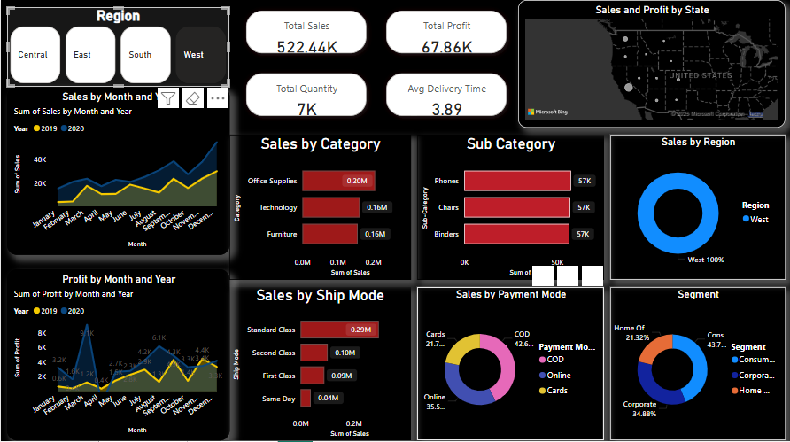

# PowerBI_Dashboard_And_Forecasting_Project

# Store Sales Forecasting in Excel

## Overview
This project focuses on sales forecasting using Microsoft Excel based on historical store sales data. The dataset contains details about orders, customers, products, sales, and profits, enabling insights into trends and predictions for future sales performance.

## Dataset Description
The dataset includes the following key columns:
- *Order Details*: Order ID, Order Date, Ship Date, Ship Mode
- *Customer Information*: Customer ID, Customer Name, Segment, Region, City, State
- *Product Details*: Product ID, Category, Sub-Category, Product Name
- *Sales Metrics*: Sales, Quantity, Profit, Returns
- *Payment Details*: Payment Mode

## Project Objectives
- *Data Cleaning & Preparation*: Handling missing values, correcting data formats, and removing irrelevant fields.
- *Exploratory Data Analysis (EDA)*: Identifying sales trends, best-selling products, and customer segments.
- *Forecasting Sales*: Using Excel functions such as Moving Averages, Exponential Smoothing, and Regression Analysis.
- *Visualization & Dashboarding*: Creating interactive dashboards in Excel to track sales trends and forecasts.

## Tools Used
- *Microsoft Excel*: Data cleaning, analysis, and visualization
- *Excel Functions & Features*:
  - Pivot Tables & Charts
  - Data Analysis ToolPak
  - Forecast Sheet & Trendlines
  - Moving Averages & Exponential Smoothing

## How to Use
1. *Load the Dataset*: Open the StoreSales.csv file in Excel.
2. *Data Cleaning*: Remove missing values, correct date formats, and standardize fields.
3. *Perform EDA*: Use Pivot Tables and Charts to analyze sales trends.
4. *Apply Forecasting Techniques*: Utilize Excel’s Forecast Sheet, Moving Averages, and Regression tools.
5. *Build a Dashboard*: Create an interactive Excel dashboard to visualize sales insights.

## Expected Outcomes
- A clean and structured dataset for sales forecasting.
- Sales trends and insights for different product categories and customer segments.
- Predictive models to estimate future sales performance.
- A user-friendly Excel dashboard for data-driven decision-making.

